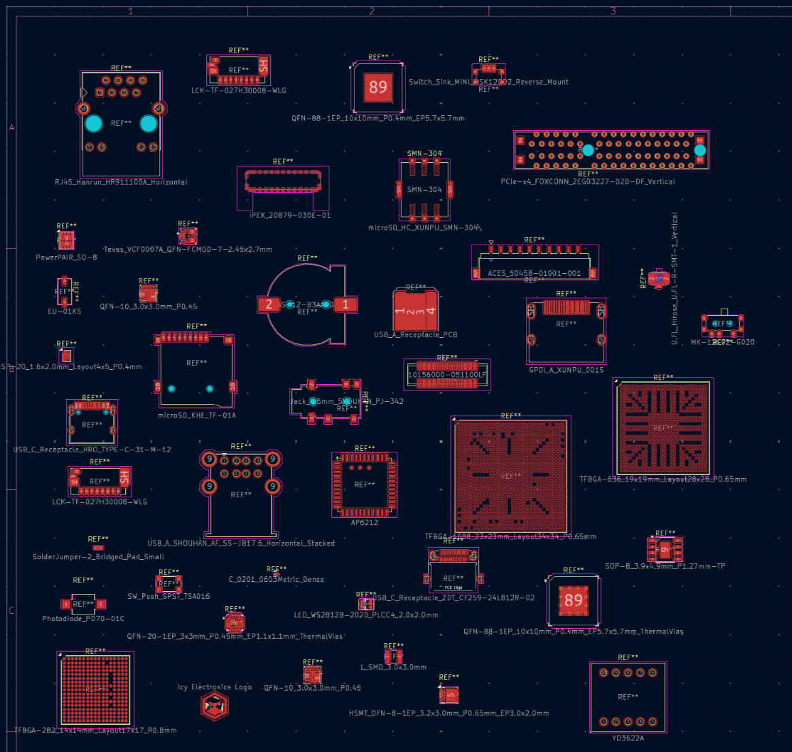
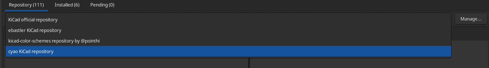

# ckl



An assortiment useful footprints and symbols for digital designs.

Currently contains 65 footprints and 68 symbols.

## How to install

Open the KiCad "Plugin and Content Manager" (referred to as "PCM" from now on) and click on "Manage". Add a new entry with the plus sign and paste

```
https://raw.githubusercontent.com/cheyao/cyao-kicad-repo/main/repository.json
```

From this point on you will have "cyao KiCad repository" in your drop-down selection, and it will allow you to install (and update) ckl through PCM - easy and hassle-free.



## Disclaimer

### **We do not assume any responsibility for broken PCBs or damages derived from errors in this library. Use at your own risk, and please open an issue or pull-request if you encounter any errors.**

Please do not use any footprint from this library with a symbol from another library (or the other way round). Pin numbering conventions are not always the same, and unless you check very carefully this can lead to broken PCBs.

## Credits

The repo structure was largely inspired by ebastler's https://github.com/ebastler/ebastler-kicad-repository

